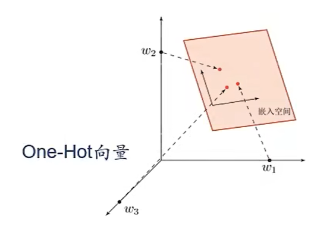

# 第一讲 绪论😄

1. 神经网络与深度学习是一种交集的关系；目前深度学习的主要模型是神经网络，因此两者大致上是等价的。（*深度学习指的是链路较长、需要考虑贡献度分配的一类机器学习问题。*）
2. 机器学习的三要素是模型、优化算法和学习准则；机器学习的类型主要包括无监督学习（密度估计、聚类、自编码器等）、监督学习和强化学习。

## 1.1 人工智能

1. 诞生于1956年达特茅斯会议。
2. 核心可以概括为计算机控制+智能行为，并没有规定具体的技术路线（这一点上要与“类脑智能”做出区分）。
3. 人工智能的流派大致上包括了**连接主义**（强调智能存在于神经元和神经元之间的连接中，可解释性很差）、**符号主义**（强调用符号定义语义，可解释性很好）和**行为主义**（强调与在环境接触中产生智能），这些主义目前已经发生了不错的结合（例如用神经网络方法实现强化学习）。
4. 人工智能的发展大致上经历了**推理期**、**知识期**（为推理器注入大量专家规则）、**学习期**（支持向量机等统计机器学习）三个阶段，到最后的深度学习的兴起。

## 1.2 如何开发人工智能系统

* 方法A：用计算机实现人工规则（即专家系统） - *对于一些自然语言处理、计算机视觉等任务，**很难找到具体的规则***。
* 方法B：机器学习（让计算机自动总结/学习规则）- 这里的规则往往就是一个映射：

$$
P[y|(x_1,x_2,...,x_n)]=f(x_1,x_2,...,x_n)
$$

* 方法C：如果任务的反馈很明确，也可以使用强化学习 - 例如下围棋。

## 1.3 表示学习

机器学习任务的一般流程如下：

* *原始数据 - 数据预处理 - 特征提取 - 特征转换 - 模型预测 - 结果*

原始数据到模型预测之间的处理过程被称为**特征工程**，因为预测模型不涉及特征学习，所以被称为**浅层学习**。

---

很难从底层特征中直接获得高层语义（即所谓的语义鸿沟），往往需要经过一系列**表示**。

一个好的表示应该具有以下特征：

* 表示能力强：一个空间应该能够表示尽量多的语义；
* 使得后面的学习任务变得更加简单；
* 表示应该具有一般性（独立于任务）；

---

表示的形式大致上可以分为

* 局部表示：独热向量（等价于符号表示），表示能力是$O(N)$，具有可解释性，在进行相似度计算时往往需要配合知识库与规则；
* 分布式表示：稠密向量，**语义分布在整个特征空间**，表示能力是$O(2^N)$，可以很方便的进行相似度计算；

局部表示是可以被嵌入到分布式表示中的（独热向量的语义只存在于坐标轴上，因此这些语义可以被嵌入到一个低维的稠密空间中的某个向量上），如下图所示：

  

因此，分布式表示也被称为**嵌入**。典型的就是NLP领域使用的词嵌入（Word Embeddings）。

---

**表示学习**让机器进行特征工程，任务是自动从数据中学习好的表示。

传统的特征提取方法包括了PCA、LDA等线性投影、LLE、Isomap、谱方法等非线性嵌入以及自编码器；往往需要设置一个好的特征标准，这些标准往往与后续的任务（例如分类）没有直接关系，依旧是一种阶段式的特征工程，这一点与表示学习是不同的（表示学习直接串联了特征提取与后续任务，得到的表示往往具有高层语义特征）。

## 1.4 深度学习

* 一个好的表示需要具有高层语义，而从底层特征到高层语义的映射对模型的深度提出了要求。
* 深度学习 = 表示学习 + 预测学习；这些内容均由计算机进行，也就是说原始数据会直接被映射为结果（端到端），整个映射的各个子映射之间存在着贡献度分配问题；神经网络很好的解决了深度学习中存在的贡献度分配问题。

深度学习的数学描述：

$$
y=f^n(f^{n-1}(f^{...}(f^1(x))))
$$

其中每个函数f是非线性的，且不一定连续。

> 当$f^1(x)$连续时，整个复合函数称为神经网络。

## 1.5 人脑神经网络

* 人体约有500亿个神经元细胞。
* 单个神经细胞只有兴奋和抑制两种状态。
* 人脑神经网络的学习可以参考赫布法则：

> 突触前神经元向突触后神经元的持续重复的刺激可以导致突触传递效能的增加。

* 知识存储在神经元之间的连接上。

## 1.6 神经网络

**人工神经元的示意图**（神经网络的示意图略）：

  

---

* 非线性函数σ定义了激活规则，除此之外还需要考虑网络的拓扑规则（神经元之间如何联系）以及学习算法。
* 目前用的比较多的网络结构大致上是前馈网络、记忆网络、图网络，以及它们的复合结构。

---

**神经网络对贡献度分配问题的解决方法**：贡献度用偏导数$\frac{\partial y}{\partial W^{(l)}}$表示,即对某个单元进行扰动，如果这个单元具有较大贡献，那么相应在最后结果上的扰动也会更大。神经网络这种解决贡献度分配的策略使得深度学习成为了可能。

## 1.7 神经网络发展史

1. 模型（人工神经网络）提出：MP模型（1943年）、B型图灵机（赫布型学习）、Marvin Minsky于1951年建造了神经网络机SNARC、Rosenblatt于1958年提出了感知机。
2. 冰河期：学习低效问题严重。感知机过于简单（线性分类器），无法处理异或回路问题，而大型神经网络的计算资源无法实现。1974年Paul Webos提出了反向传播算法；福岛邦彦于1980年提出卷积神经网络的原型。
3. 反向传播算法引起的复兴：1984年辛顿提出玻尔兹曼机；1986年有人重新发明了反向传播算法，同年辛顿等人将其引入多层感知机；1989年LeCun将反向传播引入卷积神经网络。
4. 流行度降低：20世纪90年代，高效的支持向量机等统计学习理论兴起，神经网络优化困难、可解释性差、理论基础不清晰等缺点开始凸显；
5. 崛起：2006年辛顿提出了预训练+微调策略；2013年AlexNet出现；GPU与并行训练的出现与普及提供了足够的算力。
