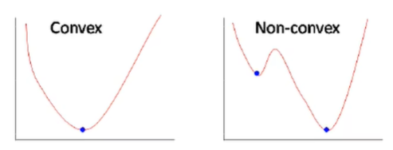

# 第二讲 机器学习概述

## 2.1 关于概率的一些基本概念

1. 概率：一个随机事件发生的可能性的大小；
2. 随机变量：（用某种方法）定义在随机事件上的变量；
3. 概率分布：随机变量取每种可能值的概率；
4. 伯努利分布：$P(x)=\mu ^x(1-\mu)^{1-x}$；表示一次伯努利实验中事件A出现的次数。
5. 二项分布：$P(X=k)=C_n^k\mu ^k(1-\mu)^{n-k}$；表示n次伯努利实验中事件A出现的次数。
6. 概率密度函数p(x)：$\int_{-\infty}^{+\infty}p(x)dx=1$。
7. 高斯分布：$x\sim \mathcal{N}(\mu ,\sigma^2)$；
8. 累计分布函数：$cdf(x)=P(X\leq x)$；
9. 随机向量：一组随机变量组成的向量；
10. 联合概率分布：$P(X_1=x_1,X_2=x_2,....X_k=x_k)=p(x_1,x_2,...,x_k)$；
11. 条件概率：$p(y|x)=\frac{p(x,y)}{p(x）}$；这里p(x)称为边缘分布。
12. **采样**：给定概率分布$p(x)$，生成满足条件的样本$x^{(1)},x^{(2)},...,x^{(n)}\sim p(x)$
    1. 均匀分布采样：线性同余发生器$ax_t+c\ mod\ m$；
    2. 有了均匀分布，可以实现大部分的离散分布采样；
    3. 其它连续分布采用逆变换采样；流程是给定$p(x)$，计算其$cdf(x)=y$，再计算$cdf^{-1}(y)=x$，对$y$进行0到1的均匀采样，带入逆函数即可得到服从$p(x)$分布的x的采样。
13. 期望：随机变量的均值；
14. 大数定律：样本数量足够大时，样本均值与期望充分接近。

## 2.2 机器学习定义

* 机器学习：自动构建某个映射函数；这个映射函数是从大量数据中进行学习的。
* 用数学描述，就是通过学习算法$\mathcal{A}$利用采样得到的$(x^{(k)},y^{(k)}),k=1,2,...,n$从假设空间$\mathcal{F}$中找到一个最优的$f^*$来近似真实的映射$g$；机器学习的特别之处是得到的$f^*$需要在整个真实分布$P_r(x,y)$上都要有好的性能，这一点与一般的拟合任务不同。

## 2.3 机器学习类型

* 回归问题：输出是连续值；
* 分类问题；例如人脸检测（二分类问题）；
* 聚类问题：一种无监督的特殊分类问题；
* 强化学习：通过与环境进行交互来学习；例如对于下围棋这种任务，对于每一步来说很难给出一个具体标注，但是可以通过最终的输赢作为反馈来让程序进行每一步决策的自动调整（使得最终受益最大化）。

机器学习的类型大致上可以分为监督学习（典型的任务是分类与回归）、无监督学习（聚类、降维、密度估计等任务）、强化学习；此外还包括半监督学习、自监督学习、弱监督学习、小样本学习（另一种分类标准，此外这些分类实际上都是依据数据的特性进行的）等等。

## 2.4 机器学习的要素

* 数据；
* 模型：来自假设空间$\mathcal{F}$；
* 学习准则：判断模型的优劣；
* 优化算法；

以回归为例，考虑一个非线性模型$f(x;\theta)=w^T\phi(x)+b$（注意，如果基函数是可学习的非线性函数，模型等价于神经网络）；损失函数量化了模型预测与真标签之间的差异，回归问题一般用平方损失，所谓的学习准则应该是最小化损失函数在真实数据分布下的期望，即所谓的期望风险。根据大数定理，期望风险是可以用采样进行近似的，即所谓的经验风险。到此，学习准则就是经验风险最小化，机器学习问题转变为寻找参数使得经验风险最小化的优化问题。

优化问题有两类，即凸优化与非凸优化，如下图所示：

  

梯度下降法是常用的优化算法，公式描述如下：

$$
\theta _{t+1}=\theta _t-\alpha\frac{1}{N}\Sigma_{n=1}^N\cfrac{\partial\mathcal{L}(y^{(n)},f(x^{(n)};\theta))}{\partial\theta}
$$

学习率α的选择很重要，太大往往无法收敛，太小则会导致收敛速度慢，好的学习率距离极值点越近时应该越小，需要动态自适应。

好的梯度下降法是随机梯度下降SGD，优点是每次计算开销小，可以支持在线学习；而采用了mini-batch的SGD则能够很好的利用计算设备的并行能力。需要注意的是，随机梯度下降的“随机”并不是说对训练数据进行随机采样，而是对训练数据进行随机排序，最终依旧是需要遍历整个训练数据集的，这保证了每个样本在每个世代中都可以被采样到。由于mini-batch的随机性，所以在判断收敛时往往用验证集进行。

## 2.5 泛化与正则化

采样过程必然存在着噪声，而噪声的影响就是使得数据偏离真实的映射；优化问题的经验风险最小化原则会使得模型完全拟合到（受到噪声影响而发生偏移的）训练集上，这样的完全拟合同样带着噪声，这就是**过拟合**。过拟合使得机器学习问题和优化问题并不等价，这种差异本质上是期望风险与经验风险的差异，这一差异即**泛化误差**。

机器学习中的优化部分依旧是要求经验风险最小化，而为了满足机器学习对期望风险最小化的要求，只能使用诸如正则化等间接方法。

普遍意义上的正则化指的是**所有损害优化的方法**，例如增加优化约束（数据增强、L1/L2优化）、干扰优化过程（权重衰减、早停、随机梯度下降）等；早停就是基于验证集而非训练集进行判断的。

## 2.6 线性回归

* 模型：$f(\bold{x};\bold{w},b)=\bold{w}^T\bold{x}+b$；进行增广：$\bold{\hat{x}}=\bold{x}\oplus1,\bold{\hat{w}}=\bold{w}\oplus b $，则可以直接表示为$f(\bold{x}; \bold{w})=\bold{w}^T\bold{x}$。
* 经验风险：$\mathcal{R}(\bold{w})=\frac{1}{2}\Sigma_{n=1}^N(y^{n}-\bold{w}^T\bold{x}^{(n)})^2$；
* 定义$\bold{X}=[\bold{x}^{(1)},\bold{x^{(2)}},...,\bold{x^{(N)}}],\bold{y}=[y^{(1)},y^{(2)},...,y^{(N)}]^T$，经验风险表示为$\mathcal{R}(\bold{w})=\frac{1}{2}||\bold{y}-\bold{X}^T\bold{w}||^2$。
* 优化问题：令$\cfrac{\partial \mathcal{R}\bold{(w)}}{\partial\bold{w}}=0$即可。

### 补充：矩阵微积分

$$
\cfrac{\partial y}{\partial \bold{x}}=[\frac{\partial y}{\partial x_1},...,\frac{\partial y}{\partial x_M}]^T
$$

$$
\cfrac{\partial\bold{y}}{\partial\bold{x}}=[\frac{\partial y_1}{\partial\bold{x}},...,\frac{\partial y_N}{\partial\bold{x}}]
$$

$$
\frac{\partial\bold{Ax}}{\partial\bold{x}}=\bold{A}^T
$$

继续讨论经验风险最小化（即优化问题）：

$$
\frac{\partial}{\partial\bold{w}}\mathcal{R}(\bold{w})=-\bold{X}(\bold{y}-\bold{X^Tw})=0\\\bold{w}=(\bold{XX^T})^{-1}\bold{Xy}
$$

上述直接令求导结果等于0的方法即最小二乘法，要求$(\bold{XX^T})^{-1}$存在，因此并不是通用的方法；$\bold{X}=[\bold{x}^{(1)},\bold{x^{(2)}},...,\bold{x^{(N)}}]\in R^{D×N}$，当D大于N时上述方法无法使用，因此可以对特征进行降维或者直接使用SGD进行优化。

对N个样本的表示问题，当特征的维度D大于N，可以认为这种表示是冗余的，即特征之间存在共线性。

### 结构风险最小化：

$$
\mathcal{R}(\bold{w})=\frac{1}{2}||\bold{y}-\bold{X}^T\bold{w}||^2+\frac{1}{2}\lambda||w||^2
$$

增加的部分就是一种正则化项。

新的优化结果是$\bold{w^*}=(\bold{XX^T}+\lambda\bold{I})^{-1}\bold{Xy}$；此时解将一直存在，这种方法就是所谓的岭回归（Ridge Regression）。

## 2.7 多项式回归

* 定义：基函数为多项式函数的回归模型，即$f=\bold{w^T}\phi(\bold{x})，\bold{w}=[w_0, w_1, ...,w_M]^T，\phi(\bold{x})=[1,\bold{x},\bold{x^2},...,\bold{x^M}]^T$；

多项式回归中的超参数是M，M=1时模型退化为线性回归；M太大时会发生过拟合，并且模型的波动也会变大、变得不稳定（往往可能在高次项上出现一些绝对值很大的参数）；这种不稳定性可以通过正则化进行惩罚，但会为模型增加一个超参数λ。

除了增加正则化项之外，控制过拟合的另一种最好的方法是增加训练样本数量，因为当样本数足够大时经验风险会足够接近期望风险。

## 2.8 线性回归的概率视角

1
